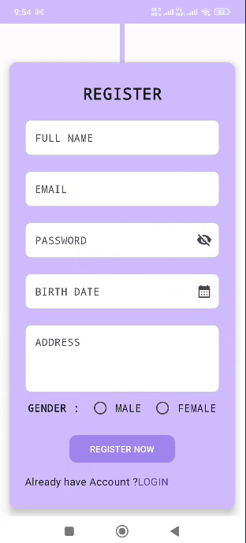

# Jetpack Compose Authentication with DataStore

This Android project demonstrates a simple and clean implementation of **Sign Up**, **Sign In**, **Sign Out**, and **Delete Account** functionality using **Jetpack Compose** and **DataStore** for local data persistence.

## 🔧 Features

- Sign Up with username and password
- Sign In to an existing account
- Store user credentials securely using DataStore
- Sign Out and navigate back to login
- Delete account (clears stored credentials)
- Built with **Jetpack Compose** for modern UI design

## 🛠️ Tech Stack

- Kotlin
- Jetpack Compose
- Android Jetpack (ViewModel, Navigation)
- DataStore Preferences
- MVVM Architecture

## 📱 Screenshots

| SignIn | SignUp | Home |
|--------------|--------------|------|
|  |  |  |

## 🚀 Getting Started

1. Clone the repository:
   ```bash
   https://github.com/MayankVariya/Compose-Auth-UI.git

